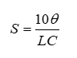
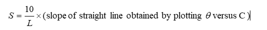

The specific rotation of the plane of polarization of sugar dissolved in water can be determined by the following formula  
 
 
Where,    θ = rotation produced in degrees.  
                L= length of the tube in centimeter.  
                C = concentration of sugar solution in g/cc.   

   Graphically S can be determined as 
                                     
