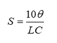
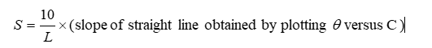

When Polarized light passes through some organic compounds the plane of polarized light is rotated. This phenomenon is called optical rotation and such substances are known as optically active compounds. If we measure the angle of rotation, the concentration of a substance in a solution can be known. The measured angle of rotation depends upon the type or nature of sample, Concentration of the optical active components, the length of the sample tube, the wavelength of the light source and the temperature of the sample.   
Specific rotation is defined as the angle through which the plane of the polarized light is rotated when the light is passed through the solution of unit length at unit concentration, when other parameters like temperature are kept constant.   
Specific rotation is determined at a usually 20 0C.Some substances rotate the plane of polarization of the light to the right (or clockwise) as viewed looking towards the light source, we sign this rotation as positive, where as some substances rotate the plane of polarization to the left (or anticlockwise), this rotation is signed as negative.   
The specific rotation of the plane of polarization of sugar dissolved in water can be determined by the following formula  
  
Where,    θ = rotation produced in degrees. (00 – 1800)  
                L= length of the tube in centimeter. (0 cm – 20 cm)  
                C = concentration of sugar solution in g/cc. (5 g/cc – 20 g/cc)  
   Graphically S can be determined as  
    
